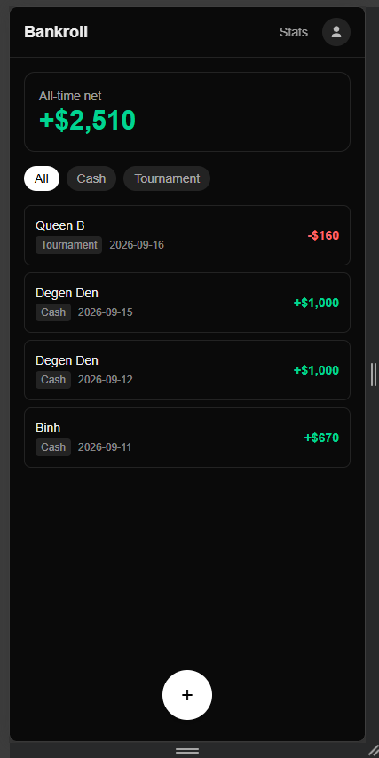
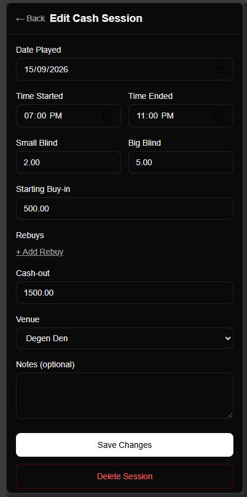
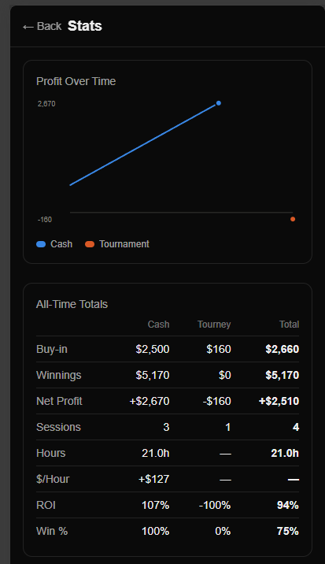
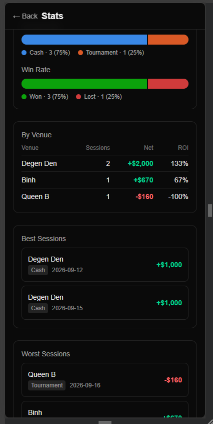

# Bankroll

A personal poker bankroll tracker. Log cash game and tournament sessions, see your all-time and by-venue numbers, and check the app from a phone via an Android client that connects to your own self-hosted server.

Single-user by design — there's no signup flow, no multi-tenant anything. It's built to run as one small Docker stack you own.

This repo is meant to be self-hosted by anyone: pull the public image, run it on your own server, install the same Android APK and point it at your own instance. Fork it and change whatever you want to fit how you actually play — nothing here is tied to my deployment.

## Screenshots

| Home | Edit Session |
| --- | --- |
|  |  |

| Stats — profit & totals | Stats — mix, venues, best/worst |
| --- | --- |
|  |  |

## Features

- **Cash sessions** — date/time (with overnight rollover handled automatically), blinds, starting buy-in plus any number of rebuys, cash-out, venue, notes. Net profit and $/hour computed automatically.
- **Live sessions** — leave the times blank when you sit down and tap **Start Session** to start a timer. Add rebuys as you play, then **Finish Session** with your cash-out (the end time defaults to now, or type one). Live sessions show at the top of the list and don't count towards any stats until they're finished. Backfilling a past session with start/end times and a cash-out still works as before.
- **Tournament sessions** — tournament name, date, buy-in plus re-entries, finish position, payout. Net profit and ROI computed automatically.
- **Venues** — save venues once in Settings, then pick them from a dropdown on session forms. Deleting a venue never rewrites history — past sessions keep the name they were logged with.
- **Stats dashboard** — cumulative profit chart (cash vs. tournament), all-time totals (buy-in, winnings, net, hours, $/hour, ROI, win %), session mix, win rate, a by-venue breakdown, and best/worst sessions.
- **Dark mode**, following the system theme.
- **Android app** — a thin native wrapper (Capacitor) around the same web app. On first launch it asks for your server's URL rather than being built against a fixed address, so the same APK works against anyone's own deployment.

## Tech stack

- [Next.js](https://nextjs.org) (App Router) + TypeScript, Server Actions for all mutations
- [Drizzle ORM](https://orm.drizzle.team) + PostgreSQL
- Hand-rolled single-user auth: bcrypt password hashing, a signed JWT session cookie
- Tailwind CSS v4
- [Capacitor](https://capacitorjs.com) for the Android client

## Local development

Requires Docker. Pick the setup that matches what you're doing:

### Fastest way to just see it running

```bash
git clone https://github.com/comprofix/bankroll.git
cd bankroll
cp .env.example .env   # fill in SESSION_SECRET, SEED_EMAIL, SEED_PASSWORD
docker compose up -d --build
```

This builds and runs the **same production image** used for real deployments (`next build` + `next start`), against its own Postgres instance — migrations and seeding run automatically. Open `http://localhost:3000` and log in with the `SEED_EMAIL`/`SEED_PASSWORD` you set.

> **This is the only way to create your account.** There's no signup page, ever — by design, for a single-user app. To change your credentials later, log in and use the in-app change-password page rather than re-seeding: seeding only creates the account if none exists yet, so it silently no-ops on every start after the first.

Note this path has **no hot reload** — it's a real production build, so you'd rebuild (`docker compose up -d --build`) after every code change. Fine for trying the app out or testing the container itself; not what you want while actively coding.

### Actively developing (hot reload)

Run just the database in Docker, and Next.js directly on your machine (requires Node ≥24, matching `engines` in `package.json`):

```bash
docker compose up -d db
npm install
cp .env.example .env   # DATABASE_URL already matches the db service above
npm run db:migrate
npm run db:seed
npm run dev
```

Open `http://localhost:3000` — this is `next dev`, so edits to `src/` hot-reload immediately.

### Testing from somewhere other than `localhost`

Both paths above work out of the box at `http://localhost:3000` because Chromium (and most browsers) treat `localhost` itself as a secure context, even over plain HTTP — the session cookie's `Secure` flag doesn't block it there. That stops being true the moment you access the app by any other host: another device on your LAN, or the Android emulator's `10.0.2.2` alias for your host machine. Over plain HTTP, those get treated as insecure origins, the `Secure` cookie gets silently dropped, and login appears to succeed but bounces you back to `/login` on the next navigation.

For that kind of testing, set in your `.env`:

```
COOKIE_SECURE=false
```

then restart (`docker compose up -d --build` or restart `npm run dev`). **Only ever do this for local testing** — never on a real deployment, since it means the session cookie is sent unencrypted.

To point the **Android app** itself at your local dev server (e.g. running in an emulator): enter `http://10.0.2.2:3000` on the onboarding screen. This works because `android/app/src/main/res/xml/network_security_config.xml` explicitly allows plaintext HTTP to `10.0.2.2` and `localhost` — and *only* those, deliberately, so a real deployment can never be silently downgraded to plaintext just by someone typing `http://` instead of `https://`. Testing from a physical device on your LAN instead of the emulator needs your machine's LAN IP added to that same file (and a rebuild) — it isn't covered by default.

## Deploying

Pre-built images are published to `ghcr.io/comprofix/bankroll` on every push to `main`, and tagged `vX.Y.Z` whenever an Android release is cut (see below) so a given APK version and its matching server image line up.

`docker-compose.prod.yml` is the reference production stack — Traefik-labeled, its own isolated Postgres, no build step, just `${VAR}` substitutions for secrets (see `.env.prod.example` for what to set). Migrations and seeding run automatically on every container start — there's no manual deploy step beyond pulling the new image.

### Via Portainer

Point a git-stack deploy at this repo's `docker-compose.prod.yml`, and set the variables from `.env.prod.example` under the stack's "Environment variables" UI. Portainer handles pulling new images on redeploy.

### Manually, using the pre-built image

On any Docker host (Traefik-fronted or not — see the network/no-reverse-proxy notes below):

```bash
git clone https://github.com/comprofix/bankroll.git
cd bankroll
cp .env.prod.example .env   # fill in HOSTNAME, POSTGRES_PASSWORD, SESSION_SECRET, etc.
docker compose -f docker-compose.prod.yml up -d
```

Compose reads that `.env` automatically for the `${VAR}` substitutions — no `env_file:` directive needed, no other setup. To pull a new version later: `docker compose -f docker-compose.prod.yml pull && docker compose -f docker-compose.prod.yml up -d`.

### Manually, building your own image

Useful if you've forked/modified the app and don't want to wait on (or set up) CI, or don't want to depend on GHCR at all:

```bash
docker build -t bankroll:local .
```

Then in your `.env`, point the compose file at it instead of the published image:

```
IMAGE_NAME=bankroll
IMAGE_TAG=local
```

```bash
docker compose -f docker-compose.prod.yml up -d
```

> **Traefik network name:** the compose file assumes your external Traefik network is called `proxy` (`networks.proxy.external: true`, and the `traefik.docker.network=proxy` label). If your Traefik setup uses a different network name, update both of those to match — otherwise Traefik won't be able to route to the container. This app also sits on a second, internal-only network for its own Postgres instance; the `traefik.docker.network` label is what tells Traefik which of the two networks to actually use (without it, Traefik picks ambiguously between them and you'll see intermittent gateway timeouts).

> **No Traefik / no reverse proxy at all?** `bankroll-app` has no published port by default — it's only reachable through Traefik on the `proxy` network. Uncomment the `ports:` section under `bankroll-app` in `docker-compose.prod.yml` to expose it directly on the host, and put your own reverse proxy/TLS termination in front of it separately (or accept plain HTTP, for local/trusted-network use only).

> **HTTPS is required** for any real deployment. The session cookie is `Secure` by default, so browsers will silently refuse to send it back over plain HTTP — login will appear to succeed, then bounce you back to `/login` on the very next navigation. Make sure whatever's in front of this terminates real TLS. `COOKIE_SECURE=false` is strictly for local testing (see "Local development" above) — never set it on a real deployment.

## Android app

Download the latest signed APK from [Releases](https://github.com/comprofix/bankroll/releases) and sideload it. On first launch, it'll ask for your server's URL (e.g. `https://bankroll.example.com`) — enter the address of your own deployment and it connects from there. Nothing is hardcoded to any particular server, so the same APK works for anyone running their own instance.

New releases are cut by pushing a `vX.Y.Z` git tag, which builds and signs the APK, publishes it as a GitHub Release asset, and tags the matching Docker image — see `.github/workflows/android-release.yml`.

> **Forking this repo?** The release workflow needs its own signing key — it won't work with mine. Generate a keystore (`keytool -genkeypair -keystore release.keystore.jks -alias bankroll -keyalg RSA -keysize 2048 -validity 36500`), base64-encode it, and add it as the `ANDROID_KEYSTORE_BASE64` and `ANDROID_KEYSTORE_PASSWORD` repo secrets. Don't commit the keystore itself — CI decodes it from the secret at build time.

## License

[MIT](LICENSE.md) — do whatever you want with this, including running it, modifying it, and redistributing it. If you do build on it, a credit or link back to this repo is appreciated, but isn't required.
